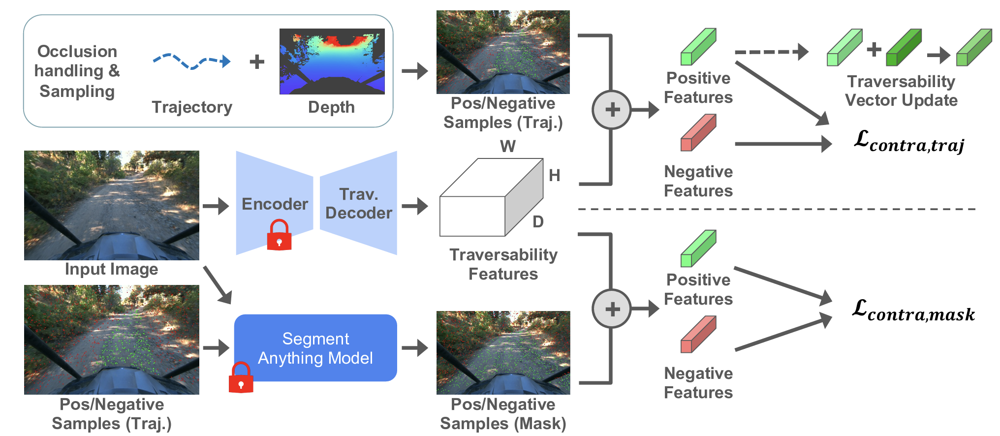

# V-STRONG: Visual self-supervised traversability learning for off-road navigation
> Sanghun Jung, JoonHo Lee, Xiangyun Meng, Byron Boots, and Alexander Lambert
> University of Washington
> ICRA 2024 <br>

<a href="https://sites.google.com/view/visual-traversability-learning"></a>
<a href="https://arxiv.org/abs/2312.16016"></a>

>**Abstract**<br>
Reliable estimation of terrain traversability is critical for the successful deployment of autonomous systems in wild, outdoor environments. Given the lack of large-scale annotated datasets for off-road navigation, strictly-supervised learning approaches remain limited in their generalization ability. To this end, we introduce a novel, image-based self-supervised learning method for traversability prediction, leveraging a state-of-the-art vision foundation model for improved out-of-distribution performance. Our method employs contrastive representation learning using both human driving data and instance-based segmentation masks during training. We show that this simple, yet effective, technique drastically outperforms recent methods in predicting traversability for both on- and off-trail driving scenarios. We compare our method with recent baselines on both a common benchmark as well as our own datasets, covering a diverse range of outdoor environments and varied terrain types. We also demonstrate the compatibility of resulting costmap predictions with a model-predictive controller. Finally, we evaluate our approach on zero- and few-shot tasks, demonstrating unprecedented performance for generalization to new environments. Videos and additional material can be found here: \url{https://sites.google.com/view/visual-traversability-learning}.

<p align="center">
  
</p>

## Repo Construction Progress
Status | Name | Date
:---:| --- | ---
⬜️| Code under preparation | 09/04/2025
⬜️| Code release | Nov. 2025 (expected)

## License
To be updated

## Cite
```
@inproceedings{jung2024v,
  title={V-strong: Visual self-supervised traversability learning for off-road navigation},
  author={Jung, Sanghun and Lee, JoonHo and Meng, Xiangyun and Boots, Byron and Lambert, Alexander},
  booktitle={2024 IEEE International Conference on Robotics and Automation (ICRA)},
  pages={1766--1773},
  year={2024},
  organization={IEEE}
}
```
